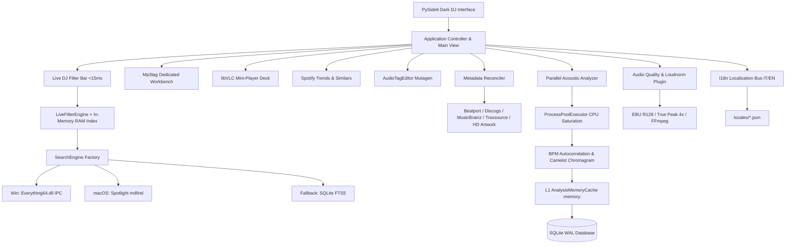
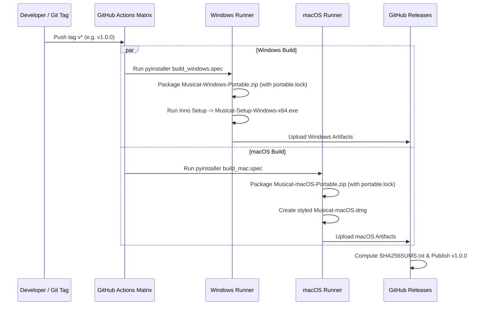

# 🏛️ Musicat Architecture & Technical Specification

> **Technical Architecture, Data Models, Multiprocessing Pipeline & Cross-Platform Engine Documentation**  
> *Documentazione Tecnica dell'Architettura, Modelli Dati, Pipeline Multiprocesso e Motore Multipiattaforma.*

---

## 1. High-Level Architecture Diagram / Diagramma Architetturale



---

## 2. Subsystem Breakdown / Componenti del Sistema

### A. Core & Storage Layer (`src/core/`)
- **`Database` (`src/core/db.py`):**
  - Thread-safe SQLite engine with WAL (Write-Ahead Logging) mode, synchronous = NORMAL, and 64MB cache size.
  - Virtual full-text indexing via SQLite **FTS5** table (`tracks_fts`) synchronized with insert/update/delete triggers.
  - Tables: `tracks`, `tags`, `directories`, `smart_crates`, `audio_quality`, `analysis_cache`.
- **`PathResolver` (`src/core/path_resolver.py`):**
  - Resolves Volume Serial Numbers (`[VOL:XXXXXXXX]`) on Windows and mount points (`/Volumes/<Name>`) on macOS.
  - Detects `portable.lock`: in portable mode, diverts all database, configuration, and log writes to the local `./musicat_data/` directory.
- **`SettingsManager` (`src/core/settings.py`):**
  - Manages atomic JSON preferences (`config.json`) with modular sections (`ui`, `audio`, `performance`, `scrapers`, `plugins`).

---

### B. Fast Search & Hardware Indexing (`src/core/search_factory.py`)
Musicat employs a three-tier fast indexing strategy tailored per operating system:

| Layer | Windows | macOS | Fallback / Linux |
|---|---|---|---|
| **Primary Driver** | `Everything64.dll` (IPC direct query on Master File Table) | `mdfind` CLI (`kMDItemContentTypeTree == 'public.audio'`) | SQLite FTS5 |
| **Query Latency** | $< 1$ ms on 100k+ files | $< 5$ ms on APFS | $< 15$ ms |
| **Memory Footprint** | External daemon IPC | Native OS kernel daemon | In-process cache |

---

### C. Parallel Acoustic DSP Engine (`src/audio/`)
Audio feature extraction is heavily CPU-bound in Python:

1. **`ProcessPoolExecutor` Worker Pool:** Dynamically scales to `max(1, os.cpu_count() - 1)` worker processes to bypass the GIL (Global Interpreter Lock).
2. **Partial-Window Streaming Read (`src/audio/worker.py`):**
   - Uses `soundfile` to read directly from disk with partial seek, extracting a 60-second central window at 22,050 Hz mono.
   - Computes BPM via autocorrelation on spectral flux onset envelopes.
   - Computes Camelot Key via constant-Q chromagram projection and correlation against major/minor key templates.
3. **L1 RAM Cache Buffer (`src/core/memory_cache.py`):**
   - Staging in an in-memory SQLite buffer (`:memory:`) eliminates excessive physical disk writes.
   - Waveform downsampled peaks are stored in an LRU memory cache, giving instant display on track click.

---

### D. Audio Quality & EBU R128 Normalizer Plugin (`src/plugins/quality_analyzer/`)
Adheres strictly to ITU-R BS.1770-4 and EBU R128 specifications:
- **Integrated Loudness (LUFS):** Perceived total track loudness.
- **True Peak (dBTP):** 4x oversampled sinc interpolation to intercept inter-sample peaks that clip Digital-to-Analog Converters (DAC).
- **Loudness Range (LRA):** Escursione dinamica in LU.
- **Dynamic Correction Engine:**
  - *Tag mode:* Writes ReplayGain tags into file tags.
  - *Physical re-encode mode:* Executes FFmpeg two-pass `loudnorm` filter (target: $-14$ LUFS, $-1.0$ dBTP ceiling).

---

### E. Internationalization Engine (`src/core/i18n.py`)
- Thread-safe singleton `I18n` with Qt signal `language_changed(str)`.
- **Zero-restart hot switching:** Table column headers, filter bar text, player labels, context menus, and settings dialog re-render instantly upon receiving `language_changed`.
- Dual-tier dictionary loading: embedded in-code dictionary guarantees zero crash if files are missing; external JSON (`locales/it.json`, `locales/en.json`) enables user extensibility.

---

## 3. Database Schema / Schema SQLite

```sql
CREATE TABLE IF NOT EXISTS tracks (
    id INTEGER PRIMARY KEY AUTOINCREMENT,
    filepath TEXT UNIQUE NOT NULL,
    filename TEXT NOT NULL,
    directory TEXT NOT NULL,
    filesize INTEGER,
    mtime REAL,
    duration REAL,
    bitrate INTEGER,
    samplerate INTEGER,
    channels INTEGER,
    format TEXT
);

CREATE TABLE IF NOT EXISTS tags (
    track_id INTEGER PRIMARY KEY,
    title TEXT,
    artist TEXT,
    album TEXT,
    albumartist TEXT,
    remixer TEXT,
    genre TEXT,
    year INTEGER,
    bpm REAL,
    musical_key TEXT,
    camelot_key TEXT,
    label TEXT,
    rating INTEGER,
    energy_level INTEGER,
    comment TEXT,
    has_cover INTEGER DEFAULT 0,
    FOREIGN KEY(track_id) REFERENCES tracks(id) ON DELETE CASCADE
);

CREATE VIRTUAL TABLE IF NOT EXISTS tracks_fts USING fts5(
    title, artist, album, genre, label, remixer, filename,
    content='tags', content_rowid='track_id'
);
```

---

## 4. Multi-OS Packaging Pipeline / Pipeline di Rilascio


