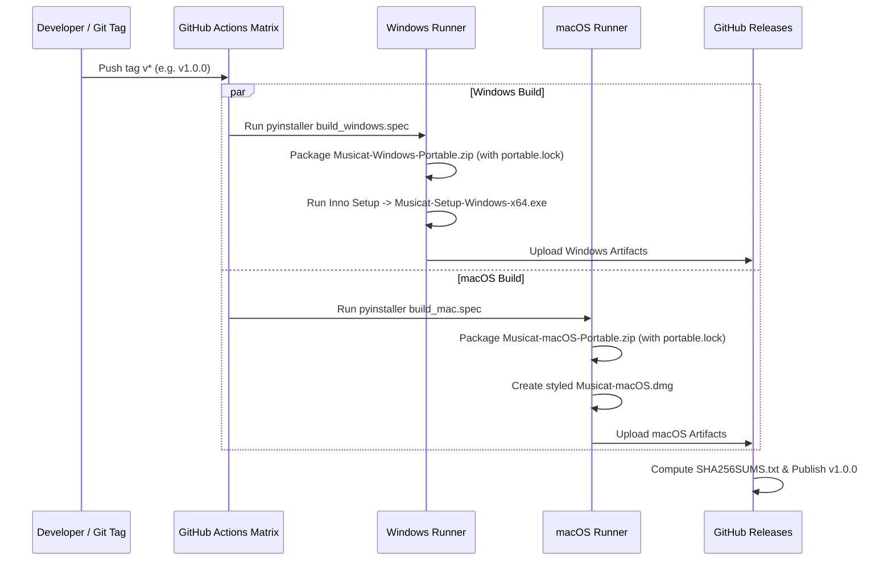

# 🏛️ Musicat Architecture & Technical Specification

> **Technical Architecture, Data Models, Multiprocessing Pipeline, Logging Subsystem & Cross-Platform Engine Documentation**  
> *Documentazione Tecnica dell'Architettura, Modelli Dati, Pipeline Multiprocesso, Sottosistema di Logging e Motore Multipiattaforma.*

---

## 1. High-Level Architecture Diagram / Diagramma Architetturale

```mermaid
graph TD
    UI[PySide6 High-Contrast Interface<br/>Light Theme Default / Dark Mode] --> Navbar[Clean Top Navbar<br/>Analysis Home / Library / Tag Editor / Smart Crates / Similars / Organize / Settings]
    
    Navbar --> Stack[QStackedWidget 6 Embedded Workspaces]
    Stack --> DJLibrary[Index 0: DJ Library View (Default Startup)<br/>Hex Header State, Drag & Drop, Live Filters & Drive Explorer]
    Stack --> AnalysisHome[Index 1: Analysis / Home View<br/>Full-Scroll Trends, Stream Preview & Async Semaphore Loader]
    Stack --> Mp3tag[Index 2: Embedded Mp3tag Spreadsheet Workbench<br/>Track Numbering Wizard & Bulk Pattern Tagging Dialog]
    Stack --> CratesBench[Index 3: Dedicated Smart Crates Workbench<br/>Interactive Rule Guide & Extended M3U8 Export]
    Stack --> Similars[Index 4: Similar Tracks Workspace<br/>Cosine Similarity Engine & Web Discovery]
    Stack --> Organize[Index 5: Embedded File Organizer<br/>Physical File Dispatcher & Collision Safety]
    Navbar --> Settings[Modular Settings Dialog]

    DJLibrary --> DriveExplorer[Clean Drive Root & Collapsed Explorer]
    DJLibrary --> FilterBar[Live DJ Expanded 2-Row Filter Bar <15ms]
    FilterBar --> FilterEngine[LiveFilterEngine + In-Memory RAM Index]
    FilterEngine --> SearchFactory[Unified Search Engine Factory]

    SearchFactory --> Everything[Windows: Everything64.dll IPC]
    SearchFactory --> Spotlight[macOS: Spotlight mdfind]
    SearchFactory --> SQLiteFTS[Fallback: SQLite FTS5]

    DJLibrary --> Player[libVLC Mini-Player Deck with +/-8% Pitch]

    Mp3tag --> PatternEngine[PatternEngine with $num token support]
    Mp3tag --> NumberWizard[Track Numbering Wizard Dialog]
    Mp3tag --> TagEditor[AudioTagEditor Mutagen]
    TagEditor --> Reconciler[Metadata Reconciler]
    Reconciler --> Scrapers[Beatport / Discogs / MusicBrainz / Traxsource / HD Artwork]

    AnalysisHome --> ParallelDSP[Parallel Acoustic Analyzer]
    ParallelDSP --> WorkerPool[ProcessPoolExecutor CPU Saturation]
    WorkerPool --> AudioDSP[BPM Autocorrelation & Camelot Chromagram]
    AudioDSP --> RAMCache[L1 AnalysisMemoryCache :memory:]
    RAMCache --> DiskDB[(SQLite WAL Database)]

    AnalysisHome --> QualityPlugin[Audio Quality & Loudnorm Plugin]
    QualityPlugin --> EBUR128[EBU R128 / True Peak 4x Sinc / FFmpeg loudnorm]

    UI --> StatusBar[Status Bar Telemetry<br/>HardwareProgressBar CPU & RAM with Dynamic Color Thresholds]
    StatusBar --> HwMonitor[HardwareMonitor Asynchronous Poller 1.5s]

    UI --> LoggerSubsys[Structured Logging Subsystem<br/>ZipRotatingFileHandler 20MB & Support Bundle]
    LoggerSubsys --> GuiLog[Thread-Safe GuiLogHandler & Live Dock]
    LoggerSubsys --> LogZipArchive[(Compressed .zip Logs 1..10)]

    UI --> I18nBus[I18n Localization Bus IT/EN]
    I18nBus --> Locales[locales/*.json]
```

---

## 2. Subsystem Breakdown / Componenti del Sistema

### A. User Interface & Navigation Layer (`src/gui/`)
- **Default Light Theme:**
  - Standard enterprise styling based on high-contrast clean backgrounds (`#FFFFFF` / `#F8F9FA`), dark grey typography (`#212529`), soft borders (`#DEE2E6`), and electric blue accents (`#0D6EFD`).
  - Dark Theme toggle available via Settings dialog without restarting.
- **6 Embedded Workspaces Architecture (`QStackedWidget` in `MainWindow`):**
  - Primary modules are hosted as embedded views in a central `QStackedWidget` rather than separate blocking popups:
    - **Index 0:** Libreria DJ (`library_container` con tabella, filtri, riordino drag & drop e albero cartelle - **Schermata Predefinita all'Avvio**)
    - **Index 1:** Analisi / Home (`HomeTrendsView` con classifiche multi-piattaforma e streaming preview 30s)
    - **Index 2:** Tag Editor Mp3tag (`Mp3tagWorkspaceWindow` incorporato in-app)
    - **Index 3:** Smart Crates (`SmartCratesView`)
    - **Index 4:** Trova Simili (`SimilarTracksView`)
    - **Index 5:** Organizza File (`OrganizerView` incorporato in-app)
  - Switching between views via top navbar is instantaneous (`view_stack.setCurrentIndex(...)`) while completely retaining active selections and playback state.
- **Full-Scrolling Trends & Async Semaphore (`HomeTrendsView` & `TrendingTrackCard`):**
  - Uncapped catalog scrolling (no arbitrary 4/5 track limit slices; loaded up to 100 tracks per category across Spotify, SoundCloud, Beatport).
  - Synchronous in-memory pixmap cache verification prevents duplicate background work.
  - Asynchronous thumbnail loading constrained by `QSemaphore(6)` prevents thread pool congestion and guarantees fluid 60 FPS scrolling.
  - In-app 30-second audio stream preview playback powered directly by the libVLC mini-player.
- **Collapsible Drive & Folder Tree Explorer (`DriveExplorerWidget`):**
  - Configured with clean logical root (`""` on Windows, `"/Volumes"` on macOS) and initial `collapseAll()`.
  - Displays exclusively top-level physical drive letters (`C:\`, `D:\`) at startup, avoiding cluttered directory dumps.
- **Interactive Drag & Drop Table Columns & Hex State Persistence (`src/gui/main_view.py`):**
  - Movable table header (`setSectionsMovable(True)`, `setDragEnabled(True)`) for interactive column reordering.
  - Serialized header layout persistence via `header.saveState().toHex()` stored in `config.json` (`ui.header_state`), restored automatically on application launch with `header.restoreState(...)`.
  - Essential DJ default view: internal diagnostic fields (`energy_level`, `lufs`, `true_peak`, `audio_status`) are hidden by default, leaving maximum readable space for the 12 primary performance columns (`#`, `Cover`, `Title`, `Artist`, `Remixer`, `BPM`, `Camelot`, `Key`, `Genre`, `Year`, `Duration`, `Bitrate`).
  - Right-click context menu (`horizontalHeader`) provides complete user-configurable toggling for all 19 columns with 1-click restore.
- **Dedicated Toolbar "Analyze Selected" Button & Async Worker (`AsyncAnalysisWorker`):**
  - Direct toolbar action `[⚡ Analizza Selezionate]` executes non-blocking background DSP calculations (BPM, Camelot Key), pattern tag extraction, cascading scraping, and Mutagen physical tag writing without freezing the UI.
  - Discrete status bar progress tracking and 1-click cancellation button `[✕ Annulla]`.
- **Dynamic Genre ComboBox with Chevron Indicator (`src/gui/live_filters.py`):**
  - Dynamically populated strictly from tracks in the SQLite database (`SELECT DISTINCT genre FROM tracks`), completely removing static genre presets.
  - Sorted with `"🏷️ Tutti i Generi"` anchored at the top, database genres in alphabetical order, and `"Vario"` at the bottom.
  - Pure CSS chevron subcontrols (`QComboBox::drop-down` and `QComboBox::down-arrow`) guaranteeing high-contrast visible dropdown arrows across both light and dark themes.
- **Two-Row High-Performance Filter Bar (<15ms):**
  - Smart Crates controls removed from the library filter bar and consolidated exclusively inside Workspace Index 3 (`SmartCratesView`).
  - Search bar expanded ($3\times$ stretch), Target BPM, Tolerance, Min/Max, Camelot Key, Decade, Audio Quality, and Quick Tag pill buttons widened for maximum legibility.
- **Visual Hardware Progress Bars in Status Bar (`HardwareProgressBar`):**
  - Compact horizontal bars in the status bar for CPU and RAM utilization.
  - Three-tier dynamic color thresholding:
    - **Green (`#28A745`):** 0% – 60% (Optimal load);
    - **Yellow / Orange (`#FD7E14`):** 61% – 84% (Moderate/elevated load);
    - **Red (`#DC3545`):** 85% – 100% (High stress/saturation).
  - Centered text display (`CPU XX%`, `RAM X.X / YY GB`) updated asynchronously every 1.5 seconds via `HardwareMonitor`.
- **Audio Quality Normalizer & Light-Themed Diagnosis Dialog (`src/gui/views/quality_view.py`):**
  - Suppressed dummy `-70 LUFS / -100 dBTP` readings on unanalyzed tracks; renders a clean deactivated placeholder `"— LUFS | TP: — dBTP (Non analizzato)"`.
  - Native Light Theme styling (`#ffffff` canvas, high-contrast dark text `#212529`).
  - Educational callout detailing ReplayGain non-destructive metadata vs FFmpeg loudnorm physical re-encoding (-1.0 dBTP headroom).
  - Interactive target sliders for Loudness (-9/-10 LUFS for club, -14 LUFS for streaming) and True Peak.

---

### B. Core & Storage Layer (`src/core/`)
- **`Database` (`src/core/db.py`):**
  - Thread-safe SQLite engine with WAL (Write-Ahead Logging) mode, synchronous = NORMAL, and 64MB cache size.
  - Virtual full-text indexing via SQLite **FTS5** table (`tracks_fts`) synchronized with insert/update/delete triggers.
  - Tables: `tracks`, `tags`, `directories`, `smart_crates`, `audio_quality`, `analysis_cache`.
- **`PathResolver` (`src/core/path_resolver.py`):**
  - Resolves Volume Serial Numbers (`[VOL:XXXXXXXX]`) on Windows and mount points (`/Volumes/<Name>`) on macOS.
  - Detects `portable.lock`: in portable mode, diverts all database, configuration, and log writes to the local `./musicat_data/` and `./logs/` directory.
- **`SettingsManager` (`src/core/settings.py`):**
  - Manages atomic JSON preferences (`config.json`) with modular sections (`ui`, `audio`, `performance`, `scrapers`, `plugins`).

---

### C. Structured Logging & Diagnostics Subsystem (`src/core/logger.py`)

Musicat incorporates an enterprise logging suite designed specifically for external customer troubleshooting and field diagnostics:

```mermaid
flowchart LR
    Subsystems[Scanners / DSP / Tags / Scrapers / Player] --> DomainLoggers[Granular Domain Loggers<br/>log_scan, log_audio_engine, log_tag_edit, log_http, log_file_op]
    DomainLoggers --> CoreLogger[MusicatLogger]
    CoreLogger --> ZipRotator[ZipRotatingFileHandler<br/>20MB File Limit -> Compress to .zip<br/>Retain last 10 archives]
    CoreLogger --> GuiHandler[Thread-Safe GuiLogHandler]
    GuiHandler --> LiveDock[Live Log Console Dock]
    CoreLogger --> ExportEngine[export_support_bundle()]
    ExportEngine --> SupportZip[Diagnostic Support Bundle .zip<br/>Logs + Hardware Metrics + DB Stats + Sanitized Config]
```

1. **`ZipRotatingFileHandler`:**
   - Limits active log file to **20 MB**.
   - Upon rotation, compresses previous log files using `zipfile.ZIP_DEFLATED` into `musicat.log.1.zip`, `musicat.log.2.zip`, etc.
   - Retains the last **10 archives**, deleting older zip archives automatically.
2. **Adaptive File Location:**
   - In Portable Mode (`portable.lock`): `./logs/` adjacent to the executable.
   - In Standard Mode: `%APPDATA%\Musicat\logs` on Windows or `~/Library/Application Support/Musicat/logs` on macOS.
3. **Granular Domain Helpers:**
   - `MusicatLogger.log_scan(...)`: Directory indexing, file counts, errors, and timing.
   - `MusicatLogger.log_audio_engine(...)`: libVLC audio actions, pitch bends, buffer underruns.
   - `MusicatLogger.log_tag_edit(...)`: Mutagen operations with pre/post JSON dumps, diffs, and corrupted ID3 header interception.
   - `MusicatLogger.log_http(...)`: Scraper requests with URL, parameters, HTTP status code, and latency in milliseconds.
   - `MusicatLogger.log_file_op(...)`: File operations with `SRC -> DEST` and collision handling (`RENAME`, `OVERWRITE`, `SKIP`).
4. **Diagnostic Support Bundle:**
   - One-click export generates an anonymized `.zip` archive containing hardware metrics, SQLite database integrity stats, sanitized configuration, and recent logs.
5. **Pre-Bootstrap Early Logging & macOS Diagnostics (`src/core/boot_diagnostics.py`):**
   - Active at the first instruction of `main.py` before any GUI, VLC or Mutagen imports.
   - Dual-file line-by-line flushed logging on macOS: `~/Library/Application Support/Musicat/logs/musicat_boot.log` and `~/Desktop/musicat_debug.log`.
   - Native C/C++ Segfault trap via `faulthandler.enable(file=primary, all_threads=True)`.
   - Deep host telemetry: Apple Silicon vs Intel detection, **Rosetta 2** translation status (`sysctl.proc_translated`), and critical environment variable capture.
   - Diagnostic dynamic probing of **libVLC** with candidate testing and dlopen `OSError` interception.
   - Verification of macOS sandbox & filesystem permissions (`/Volumes`, `~/Music`, `~/Desktop`).
   - Terminal diagnostic runner: `run_mac_debug.sh` with live terminal and desktop log capture.

---

### D. Fast Search & Hardware Indexing (`src/core/search_factory.py`)
Musicat employs a three-tier fast indexing strategy tailored per operating system:

| Layer | Windows | macOS | Fallback / Linux |
|---|---|---|---|
| **Primary Driver** | `Everything64.dll` (IPC direct query on Master File Table) | `mdfind` CLI (`kMDItemContentTypeTree == 'public.audio'`) | SQLite FTS5 |
| **Query Latency** | $< 1$ ms on 100k+ files | $< 5$ ms on APFS | $< 15$ ms |
| **Memory Footprint** | External daemon IPC | Native OS kernel daemon | In-process cache |

---

### E. Parallel Acoustic DSP Engine (`src/audio/`)
Audio feature extraction is heavily CPU-bound in Python:

1. **`ProcessPoolExecutor` Worker Pool:** Dynamically scales to `max(1, os.cpu_count() - 1)` worker processes to bypass the GIL (Global Interpreter Lock).
2. **Partial-Window Streaming Read (`src/audio/worker.py`):**
   - Uses `soundfile` to read directly from disk with partial seek, extracting a 60-second central window at 22,050 Hz mono.
   - Computes BPM via autocorrelation on spectral flux onset envelopes.
   - Computes Camelot Key via constant-Q chromagram projection and correlation against major/minor key templates.
3. **L1 RAM Cache Buffer (`src/core/memory_cache.py`):**
   - Staging in an in-memory SQLite buffer (`:memory:`) eliminates excessive physical disk writes.
   - Waveform downsampled peaks are stored in an LRU memory cache, giving instant display on track click.

---

### F. Audio Quality & EBU R128 Normalizer Plugin (`src/plugins/quality_analyzer/`)
Adheres strictly to ITU-R BS.1770-4 and EBU R128 specifications:
- **Integrated Loudness (LUFS):** Perceived total track loudness using dual-stage K-weighting pre-filters (high-shelf + RLB) and relative gating.
- **True Peak (dBTP):** 4x oversampled sinc/FIR polyphase interpolation catching inter-sample peaks that clip Digital-to-Analog Converters (DAC).
- **Loudness Range (LRA):** Dynamic span in LU computed across 3-second overlapping windows (EBU Tech 3342).
- **Dynamic Correction Engine:**
  - *Tag mode:* Writes ReplayGain tags into file tags (`REPLAYGAIN_TRACK_GAIN`, `REPLAYGAIN_TRACK_PEAK`).
  - *Physical re-encode mode:* Executes FFmpeg two-pass `loudnorm` filter (target: $-14$ LUFS, $-1.0$ dBTP ceiling).

---

### G. Internationalization Engine (`src/core/i18n.py`)
- Thread-safe singleton `I18n` with Qt signal `language_changed(str)`.
- **Zero-restart hot switching:** Table column headers, filter bar text, player labels, context menus, and settings dialog re-render instantly upon receiving `language_changed`.
- Dual-tier dictionary loading: embedded in-code dictionary guarantees zero crash if files are missing; external JSON (`locales/it.json`, `locales/en.json`) enables user extensibility.

---

### H. Cascading Metadata Scraping & Normalization (`src/scrapers/`)
Musicat employs an intelligent multi-source cascading pipeline to resolve missing metadata, genres, and release years:
1. **Multi-Source Hierarchy:**
   - **Discogs:** Primary authority for vinyl/digital releases. Prioritizes granular `styles` (e.g. *Tech House*, *Deep House*, *Melodic Techno*) over generic *"Electronic"*, and queries *Master Releases* for original year.
   - **MusicBrainz / AcousticBrainz:** Fallback for earliest release dates and community-curated tags.
   - **Beatport & Traxsource:** Specialist dance/DJ scrapers extracting exact club subgenres.
   - **`WebEnricher` Fallback (`src/scrapers/web_enricher.py`):** Queries Wikipedia Knowledge Graph and YouTube Search (`"[Artist] - [Title] genre year"`) when structured audio databases yield no results.
2. **Genre Normalization:**
   - Automatically cleans raw scraped genres, stripping unwanted tags and rejecting broad or placeholder terms (*Other*, *Unknown*, *Soundtrack*, *Music*, *Various*, *General*).
   - Assigns `"Vario"` strictly as the last resort when all scraping providers return empty results.

---

## 3. Database Schema / Schema SQLite

```sql
CREATE TABLE IF NOT EXISTS tracks (
    id INTEGER PRIMARY KEY AUTOINCREMENT,
    filepath TEXT UNIQUE NOT NULL,
    filename TEXT NOT NULL,
    directory TEXT NOT NULL,
    filesize INTEGER,
    mtime REAL,
    duration REAL,
    bitrate INTEGER,
    samplerate INTEGER,
    channels INTEGER,
    format TEXT
);

CREATE TABLE IF NOT EXISTS tags (
    track_id INTEGER PRIMARY KEY,
    title TEXT,
    artist TEXT,
    album TEXT,
    albumartist TEXT,
    remixer TEXT,
    genre TEXT,
    year INTEGER,
    bpm REAL,
    musical_key TEXT,
    camelot_key TEXT,
    label TEXT,
    rating INTEGER,
    energy_level INTEGER,
    comment TEXT,
    has_cover INTEGER DEFAULT 0,
    FOREIGN KEY(track_id) REFERENCES tracks(id) ON DELETE CASCADE
);

CREATE TABLE IF NOT EXISTS smart_crates (
    id INTEGER PRIMARY KEY AUTOINCREMENT,
    name TEXT NOT NULL UNIQUE,
    rules_json TEXT NOT NULL,
    created_at REAL,
    updated_at REAL
);

CREATE TABLE IF NOT EXISTS audio_quality (
    track_id INTEGER PRIMARY KEY,
    integrated_lufs REAL,
    true_peak_dbtp REAL,
    loudness_range_lra REAL,
    has_clipping INTEGER,
    is_low_volume INTEGER,
    is_brickwall INTEGER,
    status TEXT,
    FOREIGN KEY(track_id) REFERENCES tracks(id) ON DELETE CASCADE
);

CREATE VIRTUAL TABLE IF NOT EXISTS tracks_fts USING fts5(
    title, artist, album, genre, label, remixer, filename,
    content='tags', content_rowid='track_id'
);
```

---

## 4. Multi-OS Packaging Pipeline / Pipeline di Rilascio


