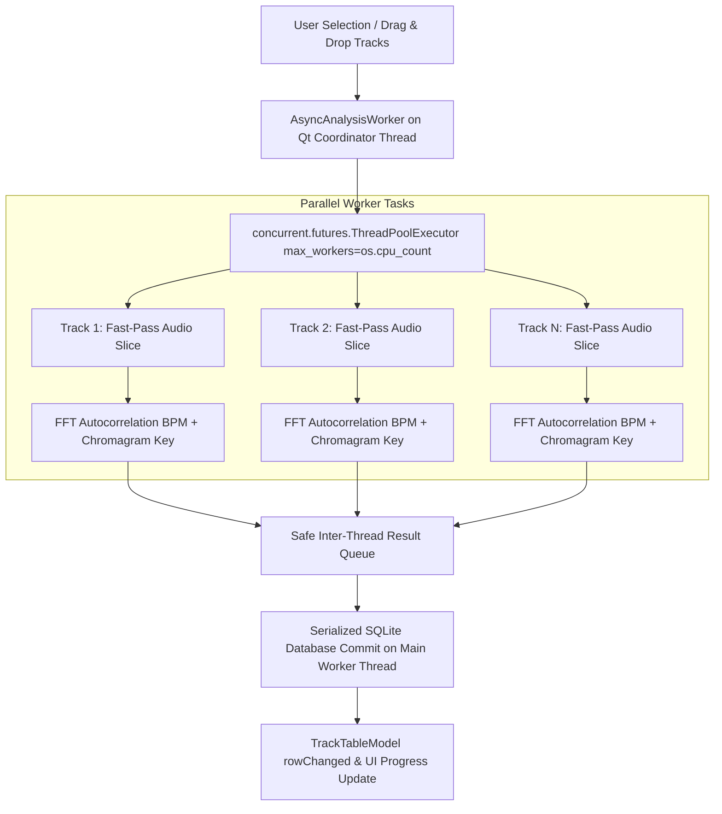
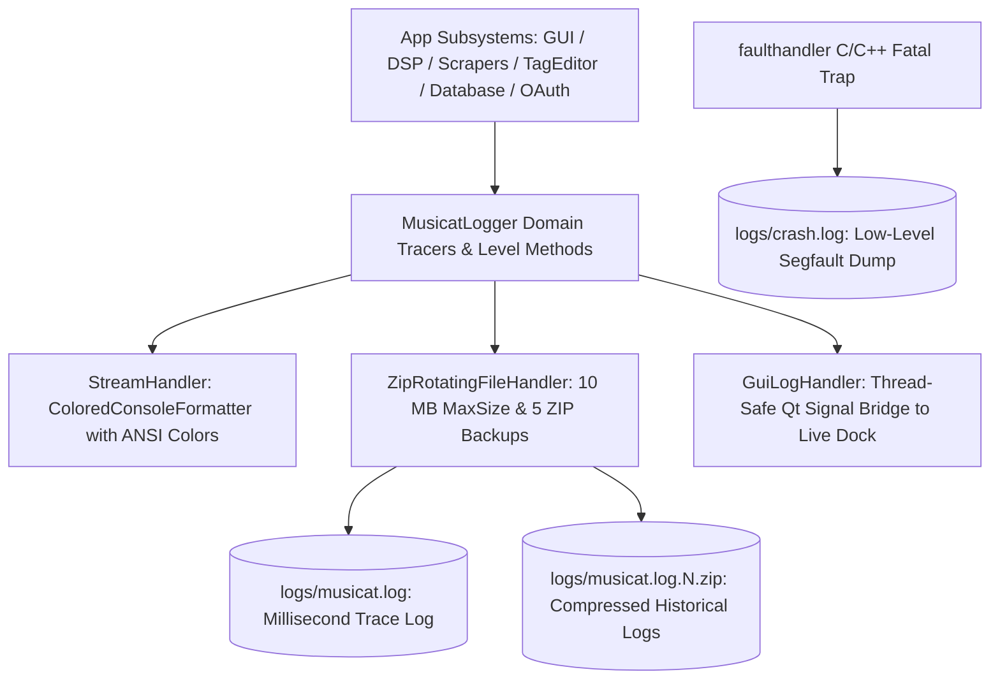

# 🏛️ Musicat Architecture & Technical Specification

> **Technical Architecture, Data Models, Multiprocessing Pipeline, Logging Subsystem & Cross-Platform Engine Documentation**  
> *Documentazione Tecnica dell'Architettura, Modelli Dati, Pipeline Concorrente, Sottosistema di Logging e Motore Multipiattaforma.*

---

## 1. High-Level Architecture Diagram / Diagramma Architetturale

```mermaid
graph TD
    UI[PySide6 High-Contrast Interface<br/>Light Theme Default / Hot Dark Theme Toggle / Maximized Boot] --> Navbar[Clean Top Navbar<br/>Library / Top Charts / Tag Editor / Similar / Organize / Smart Crates / Settings]
    
    Navbar --> Stack[QStackedWidget 6 Embedded Workspaces]
    Stack --> DJLibrary[Position 1: DJ Library View<br/>Responsive Scroll Overflow, Drag & Drop Table, Quick Access & Clear View]
    Stack --> AnalysisHome[Position 2: Top Charts View<br/>Full-Scroll Trends, Stream Preview 30s & Similar Context]
    Stack --> Mp3tag[Position 3: Independent Tag Editor Mp3tag Workspace<br/>Isolated State, Internal File/Folder Import, Wizard & Bulk Pattern]
    Stack --> Similars[Position 4: Similar Tracks Workspace<br/>Cosine Similarity Engine & Web Vectors Discovery]
    Stack --> Organize[Position 5: Embedded File Organizer<br/>Physical File Dispatcher & Collision Safety]
    Stack --> CratesBench[Position 6: Dedicated Smart Crates Workbench (Docked Right)<br/>Interactive Rule Guide & Extended M3U8 Export]
    Navbar --> Settings[Position 7: Modular Settings Dialog<br/>Hot-Swap Stylesheet, Bundled FFmpeg & Online Accounts]

    DJLibrary --> QuickAccess[Quick Access Sidebar Shortcuts<br/>Desktop / Documents / Downloads / Music & Physical Drives]
    DJLibrary --> FilterBar[Responsive Live Filter Bar in QScrollArea <15ms]
    FilterBar --> FilterEngine[LiveFilterEngine + In-Memory RAM Index]
    FilterEngine --> SearchFactory[Unified Search Engine Factory]

    SearchFactory --> Everything[Windows: Everything64.dll IPC]
    SearchFactory --> Spotlight[macOS: Spotlight mdfind]
    SearchFactory --> SQLiteFTS[Fallback: SQLite FTS5]

    DJLibrary --> Player[libVLC Mini-Player Deck with +/-8% Pitch & Waveform Scrubbing]

    Mp3tag --> PatternEngine[PatternEngine with $num token support]
    Mp3tag --> NumberWizard[Track Numbering Wizard Dialog]
    Mp3tag --> TagEditor[AudioTagEditor Mutagen]
    TagEditor --> Reconciler[Metadata Reconciler]
    Reconciler --> Scrapers[Beatport / Discogs / MusicBrainz / WebEnricher]

    DJLibrary --> ParallelDSP[AsyncAnalysisWorker Dynamic ThreadPoolExecutor]
    ParallelDSP --> FastPassDSP[Fast-Pass Acoustic DSP: Central Window 60-90s at 25%]
    FastPassDSP --> AudioDSP[BPM Autocorrelation & Camelot Chromagram]
    AudioDSP --> RAMCache[L1 AnalysisMemoryCache :memory:]
    RAMCache --> DiskDB[(SQLite WAL Database: Thread-Safe Coordinator Commits)]

    UI --> DspEngine[Advanced Audio DSP Engine src/audio/dsp_engine.py]
    DspEngine --> Pedalboard[Spotify Pedalboard JUCE C++ DSP]
    DspEngine --> Libavfilter[FFmpeg libavfilter adeclip/alimiter/loudnorm]
    DspEngine --> JuceBridge[JUCE External VST3 Plugin Bridge]
    DspEngine --> DspPresets[5 Studio Presets: Club Master, Vocal Clarity, Warm Analog, DJ Punch, De-Clip]

    Settings --> OAuthManager[OAuth & Account Security Manager]
    OAuthManager --> SpotifyOAuth[Spotify OAuth2: response_type=code & Loopback]
    OAuthManager --> SoundCloudAuth[SoundCloud: Session Token Direct Fallback]
    OAuthManager --> YouTubeAPI[YouTube Data API v3: Google Cloud API Key with Live Validation]

    AnalysisHome --> QualityPlugin[Audio Quality & Loudnorm Plugin]
    QualityPlugin --> EBUR128[EBU R128 / True Peak 4x Sinc / FFmpeg loudnorm]

    UI --> StatusBar[Status Bar Telemetry<br/>HardwareProgressBar CPU & RAM with Dynamic Color Thresholds]
    StatusBar --> HwMonitor[HardwareMonitor Asynchronous Poller 1.5s]

    UI --> LoggerSubsys[Structured Logging Subsystem<br/>ZipRotatingFileHandler 20MB & Support Bundle]
    LoggerSubsys --> GuiLog[Thread-Safe GuiLogHandler & Live Dock]
    LoggerSubsys --> LogZipArchive[(Compressed .zip Logs 1..10)]

    UI --> I18nBus[I18n Localization Bus IT/EN]
    I18nBus --> Locales[locales/*.json]
```

---

## 2. Subsystem Breakdown / Componenti del Sistema

### A. User Interface & Responsive Architecture (`src/gui/`)
- **Responsive Layout & Overflow Protection (`src/gui/live_filters.py`):**
  - La barra comandi e filtri della libreria è incapsulata in una `QScrollArea` orizzontale fluida con rimozione di larghezze minime vincolanti, eliminando qualsiasi sovrapposizione di widget o taglio di etichette su display a bassa risoluzione o finestre ridotte.
- **Drag & Drop Diretto sulla Tabella (`LibraryTableView` in `src/gui/main_view.py`):**
  - Supporto nativo agli eventi `dragEnterEvent`, `dragMoveEvent` e `dropEvent`. Il rilascio di file o cartelle esegue la scansione asincrona dei formati audio supportati, l'inserimento nel database SQLite e l'aggiornamento immediato del modello della tabella.
- **Pulsante "Svuota Vista" (`btn_clear_view`):**
  - Consente di azzerare la vista tabellare (`table_model.clear_view()`) senza cancellare fisicamente i file dal disco rigido né rimuovere le voci dal database, offrendo un piano di lavoro pulito all'utente.
- **Barra Laterale ad Accesso Rapido (`sidebar_widget` in `src/gui/main_view.py`):**
  - Riorganizzata con cartelle di sistema in cima (Desktop, Documenti, Download, Musica) risolte dinamicamente tramite `Path.home()`, seguite dalla sezione "Questo PC / Dischi" con l'albero delle sole unità di memorizzazione.
- **Menu Contestuale Avanzato:**
  - Primo elemento in grassetto **`[⚡ Analizza Tracce Selezionate]`** per elaborazione mirata delle sole righe selezionate.
  - Voce **`[🏷️ Invia a Tag Editor (Mp3tag)...]`** per instradare le tracce scelte al modulo di tagging senza azzerare la libreria.
- **Cambio Tema a Caldo (Hot-Swapping):**
  - Commutazione istantanea tra tema chiaro e tema scuro applicata a livello di `QApplication.setStyleSheet()` e `style().polish()` senza distruggere i widget né chiudere la finestra delle Impostazioni.

---

### B. Parallel Acoustic DSP & Fast-Pass Analysis Pipeline (`src/audio/`)
L'estrazione delle caratteristiche acustiche dei brani (BPM, tonalità Camelot, True Peak, LUFS) sfrutta una pipeline multi-core altamente ottimizzata:


```mermaid
flowchart TD
    Select[User Selection / Drag & Drop Tracks] --> Coordinator[AsyncAnalysisWorker on Qt Coordinator Thread]
    Coordinator --> Pool[concurrent.futures.ThreadPoolExecutor max_workers=os.cpu_count]
    
    subgraph Parallel Worker Tasks
        Pool --> Task1[Track 1: Fast-Pass Audio Slice]
        Pool --> Task2[Track 2: Fast-Pass Audio Slice]
        Pool --> TaskN[Track N: Fast-Pass Audio Slice]
        
        Task1 --> DSP1[FFT Autocorrelation BPM + Chromagram Key]
        Task2 --> DSP2[FFT Autocorrelation BPM + Chromagram Key]
        TaskN --> DSPN[FFT Autocorrelation BPM + Chromagram Key]
    end
    
    DSP1 --> Queue[Safe Inter-Thread Result Queue]
    DSP2 --> Queue
    DSPN --> Queue
    
    Queue --> SerialCommit[Serialized SQLite Database Commit on Main Worker Thread]
    SerialCommit --> ModelNotify[TrackTableModel rowChanged & UI Progress Update]
```

1. **Parallelizzazione Multi-Core:**
   - La classe `AsyncAnalysisWorker` alloca un `ThreadPoolExecutor` dimensionato dinamicamente (`max(2, min(os.cpu_count(), 8))`). L'elaborazione DSP intensiva avviene simultaneamente su più core logici.
2. **Fast-Pass Acoustic Analysis (`load_audio_sample` in `src/audio/analyzer.py`):**
   - Non effettua la decodifica dell'intero file audio; cerca (*seek*) il punto corrispondente al 25% della durata complessiva e carica un campione centrale rappresentativo di 60–90 secondi, riducendo l'overhead di I/O su dischi USB e l'uso di memoria RAM di oltre l'80%.
3. **Scraping Asincrono con Timeout Rigidi:**
   - Le interrogazioni di arricchimento verso Discogs, MusicBrainz e WebEnricher impiegano timeout stringenti (2.5 – 3.0 secondi), garantendo che eventuali colli di bottiglia di rete non rallentino la coda di elaborazione dei brani.

---

### C. State Isolation & Decoupling tra Libreria e Mp3tag Workspace (`src/gui/mp3tag_workspace.py`)
Musicat garantisce la totale indipendenza dello stato del Tag Editor:

1. **Disaccoppiamento della Vista:**
   - Il passaggio alla schermata Mp3tag (`_switch_view`) non esegue più alcun caricamento o azzeramento automatico della griglia dati. Lo spazio di lavoro conserva esattamente i file aperti dall'utente fino a esplicito salvataggio o svuotamento.
2. **Canali di Input Espliciti:**
   - Tracce inviate tramite click destro dalla Libreria (`[🏷️ Invia a Tag Editor (Mp3tag)...]`).
   - Pulsanti toolbar/menu dedicati: `[➕ Aggiungi File...]` (`Ctrl+O`), `[📁 Aggiungi Cartella...]` (`Ctrl+D`), `[🧹 Svuota Elenco]`.
   - Drag & Drop diretto di file e directory sulla finestra del workbench (`Mp3tagTableWidget`).
3. **Editor Massivo Pattern e Rinumerazione:**
   - `FilenameToTagDialog` e `TagToFilenameDialog` consentono l'estrazione e la scrittura fisica di token avanzati (`%artist%`, `%title%`, `%album%`, `$num(%track%,2)`).
   - `TrackNumberingWizardDialog` gestisce la numerazione sequenziale con azzeramento al cambio di cartella/album e padding personalizzato.

---

### D. Audio DSP Engine & Mastering Pipeline (`src/audio/dsp_engine.py`)
1. **Spotify Pedalboard & Vectorized Fallback:**
   - C++ DSP engine basato su JUCE (`HighpassFilter`, `LowpassFilter`, `PeakFilter`, `Compressor`, `Limiter`).
   - In caso di assenza dei binari compilati, interviene il processore vettoriale NumPy/SciPy con filtri Butterworth e limiter soft-saturation (`tanh`).
2. **FFmpeg libavfilter Pipeline Broadcast:**
   - De-clipping digitale (`adeclip`), noise reduction (`afftdn`), equalizzazione e limiting con lookahead (`alimiter`).
   - Risoluzione automatica di `ffmpeg.exe` e `ffprobe.exe` integrati nella cartella `bin/` portatile, con supporto a binari personalizzati configurabili in Impostazioni.
3. **5 Preset Mastering per DJ:**
   - *Club Master* (-0.5 dBTP), *Vocal Clarity*, *Warm Analog*, *DJ Punch*, *De-Clip & Clean*.

---

### E. OAuth & Online Accounts Authentication Engine (`src/core/oauth_manager.py`, `src/services/spotify_auth.py`)
1. **Spotify Authorization Code Flow (`SpotifyAuth`):**
   - Costruzione standard conforme dell'URL: `https://accounts.spotify.com/authorize` con `response_type=code`, `client_id`, `redirect_uri=http://localhost:8888/callback` e scope per la lettura e manipolazione delle playlist.
   - Gestione server di loopback locale per la ricezione sicura del codice di autorizzazione e lo scambio con token Bearer.
2. **SoundCloud Session Token Fallback:**
   - Supporto all'immissione manuale sicura del token di sessione per aggirare la chiusura delle registrazioni di nuove app per sviluppatori su SoundCloud.
3. **YouTube Data API v3:**
   - Supporto Google Cloud API Key con test asincrono di validazione immediata, eliminando gli errori `401: invalid_client` per le ricerche pubbliche.

---

### F. Multi-OS Packaging & Release Pipeline
1. **PyInstaller Spec (`build_windows.spec`):**
   - Riconoscimento automatico delle dipendenze C++ native (PySide6, soundfile, scipy, pedalboard, vlc, onnxruntime).
   - Inclusione degli asset, delle cartelle `locales/` e dei binari predefiniti `bin/ffmpeg.exe`.
2. **Portabilità Totale (`portable.lock`):**
   - Il rilevamento del file `portable.lock` dirotta tutte le scritture di database, configurazione e log nella directory locale dell'applicazione, consentendo l'uso immediato da chiavette USB su qualsiasi workstation.

---

## 3. Database Schema / Schema SQLite (`src/core/db.py`)

```sql
CREATE TABLE IF NOT EXISTS tracks (
    id INTEGER PRIMARY KEY AUTOINCREMENT,
    filepath TEXT UNIQUE NOT NULL,
    filename TEXT NOT NULL,
    directory TEXT NOT NULL,
    filesize INTEGER,
    file_mtime REAL,
    duration REAL,
    bitrate INTEGER,
    sample_rate INTEGER,
    format TEXT,
    title TEXT,
    artist TEXT,
    album TEXT,
    album_artist TEXT,
    year INTEGER,
    genre TEXT,
    track_num INTEGER,
    total_tracks INTEGER,
    disc_num INTEGER,
    bpm REAL,
    musical_key TEXT,
    camelot_key TEXT,
    initial_key TEXT,
    energy_level INTEGER,
    rating INTEGER,
    label TEXT,
    remixer TEXT,
    comment TEXT,
    has_cover INTEGER DEFAULT 0,
    lufs REAL,
    true_peak REAL,
    audio_status TEXT,
    waveform_peaks BLOB,
    analyzed_at TIMESTAMP,
    created_at TIMESTAMP DEFAULT CURRENT_TIMESTAMP,
    updated_at TIMESTAMP DEFAULT CURRENT_TIMESTAMP
);

CREATE VIRTUAL TABLE IF NOT EXISTS tracks_fts USING fts5(
    title, artist, album, genre, label, remixer, comment, filename,
    content='tracks', content_rowid='id'
);
```

---

## 4. Logging & Diagnostics System / Sistema di Logging e Diagnostica (`src/core/logger.py`)

Musicat adotta un'infrastruttura di telemetria e diagnostica enterprise ad alta visibilità concepita per operare in ambienti desktop distribuiti, installazioni standalone e modalità portatili da chiavetta USB:


```mermaid
flowchart TD
    Subsystems[App Subsystems: GUI / DSP / Scrapers / TagEditor / Database / OAuth] --> Dispatcher[MusicatLogger Domain Tracers & Level Methods]
    
    Dispatcher --> ConsoleHandler[StreamHandler: ColoredConsoleFormatter with ANSI Colors]
    Dispatcher --> FileHandler[ZipRotatingFileHandler: 10 MB MaxSize & 5 ZIP Backups]
    Dispatcher --> GuiHandler[GuiLogHandler: Thread-Safe Qt Signal Bridge to Live Dock]
    
    FaultTrap[faulthandler C/C++ Fatal Trap] --> CrashLog[(logs/crash.log: Low-Level Segfault Dump)]
    FileHandler --> MainLog[(logs/musicat.log: Millisecond Trace Log)]
    FileHandler --> ZipArchives[(logs/musicat.log.N.zip: Compressed Historical Logs)]
```

### A. Gerarchia dei Logger e Propagazione degli Handler
1. **Logger Radice (`MusicatLogger.get_logger()`):**
   - Nome del logger: `"musicat"`.
   - Livello configurabile dinamicamente (`DEBUG` in fase di sviluppo/diagnostica, `INFO` in produzione).
   - `propagate = False` per evitare duplicazioni non controllate verso il logger di default Python.
2. **Multi-Handler Setup:**
   - **Console Handler (`StreamHandler`):** impiega `ColoredConsoleFormatter` con codici escape ANSI per differenziare a colpo d'occhio i livelli di severità su terminali Windows Terminal, macOS Terminal e Linux bash/zsh:
     - `DEBUG`: Grigio chiaro (`\033[90m`)
     - `INFO`: Ciano (`\033[96m`)
     - `WARNING`: Giallo/Ambra (`\033[93m`)
     - `ERROR`: Rosso (`\033[91m`)
     - `CRITICAL`: Rosso brillante su sfondo scuro (`\033[1;91m`)
   - **Rotating File Handler con Compressione ZIP (`ZipRotatingFileHandler`):**
     - Scrive in append con codifica UTF-8 su `musicat.log`.
     - Soglia di rotazione: **10 MB** (`10 * 1024 * 1024` byte).
     - Retention: **5 file storici di backup** (`backupCount=5`).
     - Al superamento della dimensione massima, il file uscente viene compresso al volo in archivio ZIP (`musicat.log.1.zip` .. `musicat.log.5.zip`) e il file attivo viene riazzerato atomicamente, risparmiando oltre l'85% dello spazio su disco.
     - **Flush & Sync Immediato (`fsync`):** Per ogni record di severità `ERROR` o `CRITICAL`, l'handler esegue `stream.flush()` seguito da `os.fsync(stream.fileno())` garantendo la scrittura fisica su storage magnetico o NAND prima di eventuali crash di sistema.
   - **Crash / Faulthandler Log Trap (`logs/crash.log`):**
     - Registrato tramite `faulthandler.enable(file=crash_fp, all_threads=True)`.
     - Intercetta a livello di kernel i segnali fatali generati da codice non gestito C/C++ (`SIGSEGV`, `SIGFPE`, `SIGILL`, `SIGBUS`, `0xC0000005: Access Violation` su Windows).
     - Emette il dump dello stack trace di tutti i thread attivi al momento del crash, identificando la funzione Python o la libreria nativa condivisa (VLC, libavcodec FFmpeg, JUCE VST3, DirectML/CUDA) responsabile del guasto.
   - **GUI Dock Handler (`GuiLogHandler`):**
     - Incapsula una coda protetta da segnali PySide6 (`log_record_signal`) per inviare i messaggi formattati alla console log integrata nell'interfaccia senza bloccare il thread grafico.

### B. Percorsi Standard di Memorizzazione dei File di Log
La classe `PathResolver` garantisce che i percorsi dei log siano determinati in modo conforme alle linee guida di ciascun sistema operativo:

| Piattaforma | Modalità | Percorso File di Log Principale | Percorso File di Crash |
| :--- | :--- | :--- | :--- |
| **Windows** | Portatile (`portable.lock`) | `<AppDir>\logs\musicat.log` | `<AppDir>\logs\crash.log` |
| **Windows** | Installata / Standard | `%APPDATA%\Musicat\logs\musicat.log` | `%APPDATA%\Musicat\logs\crash.log` |
| **macOS** | Portatile (`portable.lock`) | `<AppDir>/logs/musicat.log` | `<AppDir>/logs/crash.log` |
| **macOS** | Standard Bundle | `~/Library/Application Support/Musicat/logs/musicat.log` | `~/Library/Application Support/Musicat/logs/crash.log` |
| **macOS Debug** | Link di Sviluppo | `~/Desktop/musicat_debug.log` | - |
| **Linux** | Standard XDG | `~/.local/share/Musicat/logs/musicat.log` | `~/.local/share/Musicat/logs/crash.log` |

### C. Formato dei Log con Risoluzione al Millisecondo
Ogni riga di log segue rigorosamente la sintassi canonica specificata:

```text
[YYYY-MM-DD HH:MM:SS.mmm] [LIVELLO] [NOME_MODULO.FUNZIONE:RIGA] [THREAD_NAME] - Messaggio
```

**Esempio di Traccia Operativa:**
```text
[2026-10-28 12:20:15.142] [DEBUG] [reconciler.fetch_discogs:84] [WorkerThread-2] - Querying Discogs for "Gelosia"...
[2026-10-28 12:20:15.890] [INFO]  [analyzer.estimate_bpm:228] [AcousticPool-0] - BPM estimated: 126.0 (confidence: 0.94)
[2026-10-28 12:20:16.012] [ERROR] [editor.write_metadata:463] [MainThread] - [TAG:WRITE_LOCK] File locked or permission error on 'track.mp3': [Errno 13] Permission denied
```

### D. Metodi di Tracciamento per Flussi Chiave (`Subsystem Domain Tracers`)
Per evitare formattazioni eterogenee, `MusicatLogger` espone metodi dedicati a ciascun sottosistema:
- `log_bootstrap()`: Telemetria di avvio (OS, versione Python, CPU, memoria fisica, backend GPU, path FFmpeg e libVLC).
- `log_scan(folder, files_found, skipped_files, errors)`: Riepilogo scansione ricorsiva file system.
- `log_worker(worker_name, action, task_id, progress, error)`: Ciclo di vita dei thread di lavoro asincroni.
- `log_acoustic(filepath, bpm, key, camelot, duration_s)`: Metriche estratte dall'analisi FFT/chromagram.
- `log_scraping(provider, query, status_code, elapsed_ms, details)`: Chiamate HTTP a provider esterni.
- `log_tag_edit(filepath, fields_updated, pre_dump, post_dump, success, error)`: Audit di scrittura tag con dump differenziale pre/post modifica.
- `log_audio_engine(engine, preset, input_file, output_file, lufs, true_peak, success, error)`: Parametri di mastering audio DSP.
- `log_oauth(service, action, success, details)`: Autenticazione OAuth e token exchange loopback.
- `log_file_op(operation, src, dst, success, error)`: Spostamenti e ridenominazioni fisiche sul filesystem.

---

## 5. Codebase Standards / Standard di Sviluppo del Codice

Per garantire l'eccellenza ingegneristica, la manutenibilità a lungo termine e l'assenza di regressioni, tutti i moduli del repository Musicat devono rispettare rigorosamente le seguenti linee guida:

### A. Convenzioni Docstring (Google Style / Sphinx)
Tutte le classi, metodi pubblici e funzioni di modulo devono essere documentati secondo lo standard **Google Style**:

```python
def example_function(param_a: str, param_b: int = 10) -> bool:
    """Sintetica descrizione di una riga terminata da punto.

    Descrizione dettagliata dell'algoritmo o della logica applicata, con note
    sul funzionamento interno e considerazioni sulle prestazioni.

    Args:
        param_a (str): Descrizione del parametro di input.
        param_b (int): Valore numerico indicante la soglia. Defaults to 10.

    Returns:
        bool: True se l'operazione ha avuto successo, False altrimenti.

    Raises:
        FileNotFoundError: Se il percorso specificato non esiste su disco.
        ValueError: Se il valore fornito eccede l'intervallo consentito.
    """
```

### B. Type Hinting Sistematico e Analisi Statica
- Tutti gli argomenti di funzioni e i valori di ritorno devono includere type hints completi (`typing.Optional`, `typing.Dict`, `typing.List`, `typing.Tuple`, `typing.Union`, `typing.Any`).
- La base di codice deve risultare conforme ai controlli di tipo statici eseguiti da `mypy`.
- Nei moduli che utilizzano conversioni di formato o risposte esterne, gestire esplicitamente `Optional[...]` per prevenire eccezioni di tipo `TypeError: 'NoneType' object is not subscriptable`.

### C. Struttura dei Commenti Operativi sul Codice
I commenti in-line non devono limitarsi a ripetere ciò che il codice esegue letteralmente, bensì spiegare il **perché** e il **razionale matematico/architetturale**:
- **Formule Matematiche e DSP:** Esporre il razionale armonico (es. *ruota di Camelot, Circle of Fifths mod 12, lift di semitono $7 \times 7 \equiv 1 \pmod{12}$, interpolazione parabolica al vertice sui picchi di correlazione*).
- **Concorrenza e Threading:** Commentare i vincoli di thread-safety (es. *rilascio del GIL, lock SQLite, esecuzione del commit confinata al coordinatore principale*).
- **I/O ed Exception Handling:** Esplicitare il motivo dei loop di retry con backoff e garbage collection (`gc.collect()`) su Windows per aggirare i lock temporanei causati da Windows Defender e servizi di indicizzazione.

